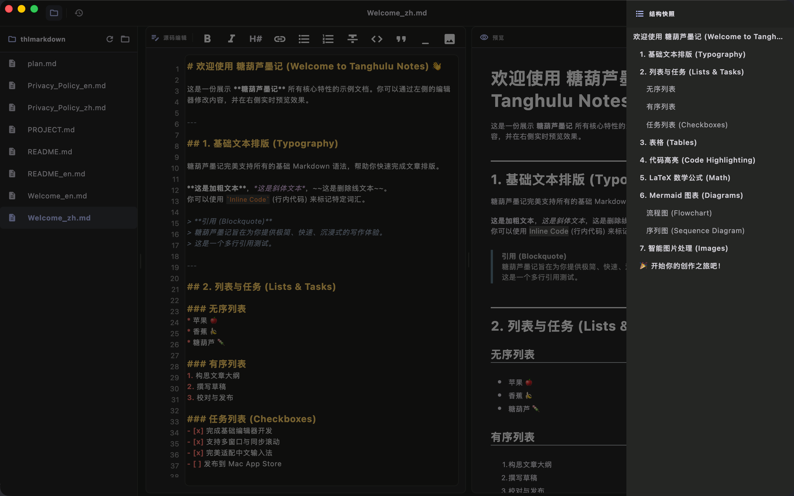
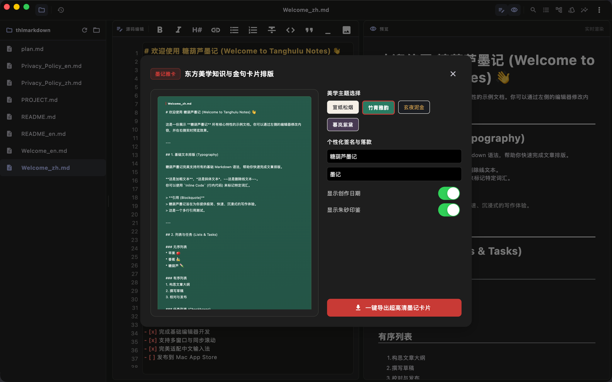
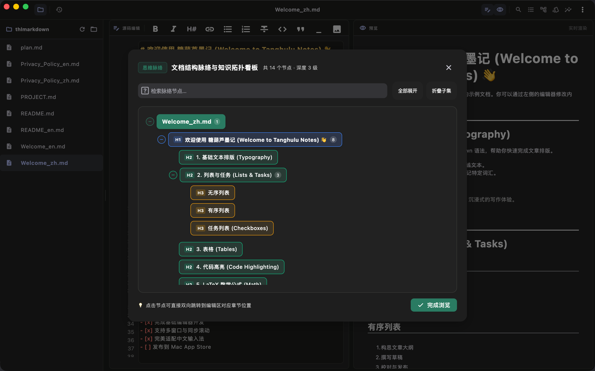
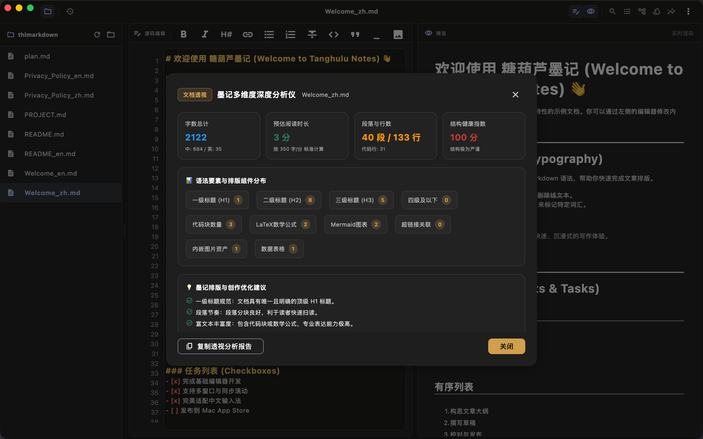
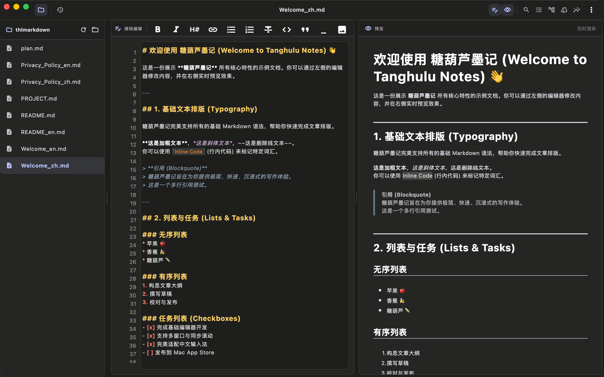

# 糖葫芦墨记

  

> **落笔生墨，文以载道。** 融合东方文人雅致与现代异构渲染技术的高性能 Markdown 写作与排版套件。

**应用名称：** 糖葫芦墨记  
**副标题：** 东方雅韵·思维脉络·高保真排版  
**平台：** macOS  
**关键词：** 墨记, Markdown, 排版, LaTeX, 思维导图, 知识卡片, 文档透视, 双栏, 写作, 代码高亮  

---

## 关于本应用

「糖葫芦墨记」是一款融合东方文人雅致美学与现代异构排版渲染技术的专业级 Markdown 创作与排版套件。打破传统编辑器枯燥单调的技术同质化设计，为技术创作者、学者、产品方案专家及知识管理者带来全新境界的沉浸式写作体验。

左侧专心写作，右侧实时排版，深度支持 LaTeX 数学公式、Mermaid 流程图表与独创的东方知识卡片。

---

## 🌟 四大独创核心特色

### 🪶 1. 独创·墨记雅卡（东方美学知识卡片生成器）
- **一键生卡**：提取选中金句或正文段落，一键排版生成极具东方神韵的高清知识卡片。
- **文人雅致主题**：提供「宣纸松烟」、「竹青雅韵」、「玄夜泥金」、「暮岚紫黛」等多款专属古典美学主题。
- **个性印鉴落款**：支持自定义作者落款、朱砂印鉴、创作日期及二维码水印，支持一键无损高清 PNG 导出与分享。

### 🧠 2. 独创·思维脉络看板（结构脉络与知识拓扑导图）
- **拓扑脑图看板**：智能解析文档多层级标题（H1-H6），自动生成可视化思维脉络动态树状看板。
- **节点热度与搜索**：支持节点一键折叠展开、字数热度感知、关键词快速检索定位。
- **双向联动导航**：画布节点与正文秒级双向联动，单击节点直接跳转至编辑区对应段落。

### 📊 3. 独创·多维深度透视仪（文档全景分析诊断）
- **全要素数据统计**：全面统计中英文字数、代码行数、段落密度与加权阅读时长估算。
- **语法与资源分布**：可视化展现标题分布、LaTeX 公式、Mermaid 图表、超链接及内嵌资源配比。
- **结构健康度评分**：提供文档结构健康度评分与排版优化建议，支持一键复制专业透视报告。

### 🖨️ 4. 独创·双轨主题隔离高保真多格式导出
- **告别样式污染**：彻底解决传统编辑器在深色模式下导出 PDF 产生“黑底黑字/样式混乱”的痛点。
- **双轨物理隔离**：编辑界面护眼深色与导出产物标准白底出版级排版完全物理隔离。
- **高保真多格式**：支持 A4/Letter 规格 PDF、带图表公式的 Word (.docx)、独立 HTML 及多页长图无损导出。
- **智能分页边界**：具备智能边界感知算法，保证图表与代码块在分页处完整不被截断。

---

## 📝 经典双栏与专业扩展排版

### ⚡ 沉浸式写作体验，所见即所得
- **实时双栏预览**：左侧编辑、右侧精准渲染。支持一键切换至“全屏沉浸”或“仅编辑/仅预览”模式。
- **打字机模式 & 聚焦模式**：让当前编辑行始终居中，并淡化非当前段落，助你排除干扰，保持心流。
- **同步滚动 (Sync Scroll)**：编辑区与预览区毫秒级同步，长篇大作修改亦不迷失。
- **极致 CJK 混输优化**：底层输入引擎深度适配 Mac 原生拼音输入法，彻底告别字母吞字与打断问题。

### 📐 学术与工程级公式与图表
- **KaTeX 矢量公式**：原生支持行内 `$` 与块级 `$$` 高性能矢量数学公式渲染。
- **Mermaid 图表绘制**：支持直接使用代码绘制流程图、时序图、类图、状态图与甘特图。
- **代码语法高亮**：深度支持主流编程语言代码高亮，呈现优雅的代码排版风格。

### 📚 强大的多窗口与文档大纲
- **原生多窗口**：支持同时开启多个独立文档窗口，跨项目对照编辑互不干扰。
- **文件树与文档大纲**：
  - 左侧边栏支持展开当前工作区目录**文件树**，秒级切换文档。
  - 右侧支持提取标题自动生成**层级大纲**，单击快速定位对应章节。
- **状态栏实时追踪**：底部状态栏实时显示当前行列、中英文词数、字符数和行数统计。

### 🖼️ 丝滑的资产管理与偏好设置
- **拖拽与快捷粘贴**：直接拖入图片，或使用快捷键粘贴剪贴板截图。
- **相对路径自动保存**：自动在文档同级创建 `assets` 目录并复制图片，告别文件分享时图片丢失。
- **支持 PicGo 图床**：一键集成 PicGo 服务，图片自动上传并返回外链。
- **一键冗余资产清理**：内置资产清理工具，一键扫描并清理未被引用的多余图片，释放存储空间。

---

## 🆕 1.0.0 首发亮点

糖葫芦墨记 1.0.0 首发版本正式发布！

- 🚀 **经典双栏实时分屏**：左侧极致流畅输入，右侧毫秒级排版预览与光标跟随
- 📐 **深度数学公式集成**：内置 KaTeX 引擎，支持行内与独立 LaTeX 公式块渲染
- 📊 **丰富扩展语法支持**：任务清单 Checkbox、Markdown 表格、高亮、删除线、上下标与脚注
- 🔍 **全局搜索与高级替换**：支持快捷键 Cmd/Ctrl+F，关键词即时高亮定位与一键替换
- 🎨 **优雅主题与代码高亮**：内置多套排版渲染主题与主流代码高亮配色
- 📤 **全功能导出管线**：支持无损导出为标准 PDF、HTML 及长图
- 🖼️ **现代资产管理**：支持本地图片管理与图床自动降级

随时随地，随心记录您的每一个灵感！

---

## 🔒 隐私先行，数据完全属于你

糖葫芦墨记 是一款纯本地驱动的应用程序：
- **0 账户要求**：无需注册，无登录门槛，开箱即用。
- **0 数据收集**：没有任何云端服务器，绝对不会收集、存储、处理或上传您的任何个人信息、文档正文内容或应用使用记录。
- **纯本地存储**：您创建的所有文档、笔记与关联图片均完全保存在您的本地磁盘中。

---

## 联系我们

- **官网**：[https://www.thltv.com/](https://www.thltv.com/)
- **邮箱**：support@thltv.com
- **Telegram 频道**：[https://t.me/tanghulutvos](https://t.me/tanghulutvos)
- **GitHub**：[https://github.com/never88gone/THLMarkDown](https://github.com/never88gone/THLMarkDown)
