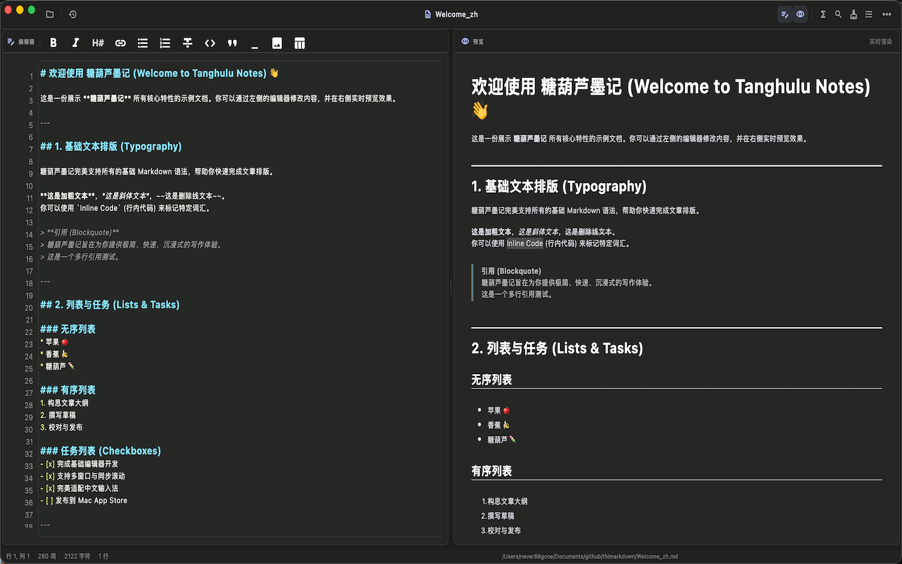
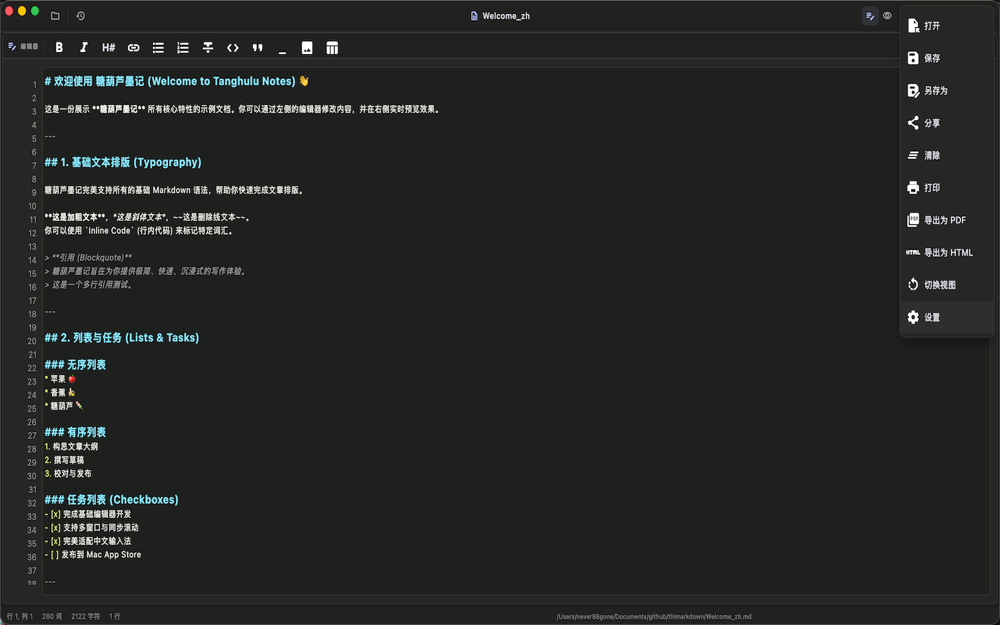
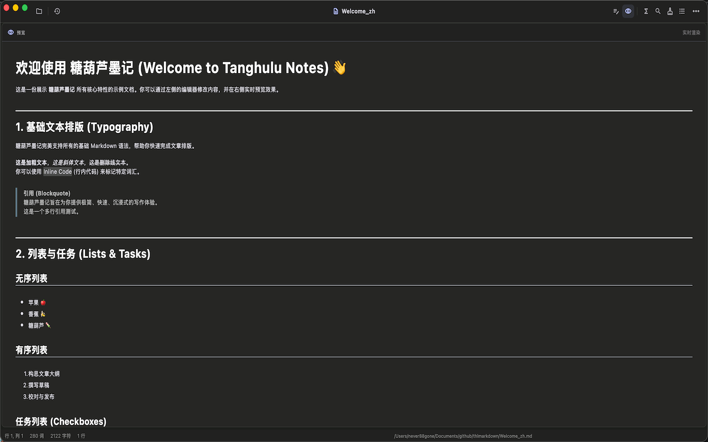
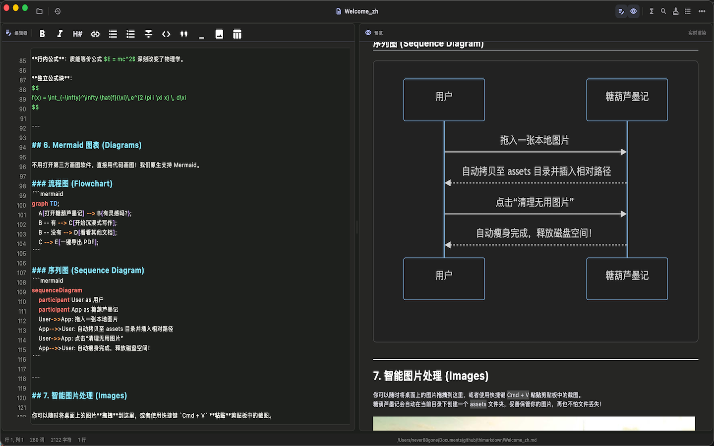
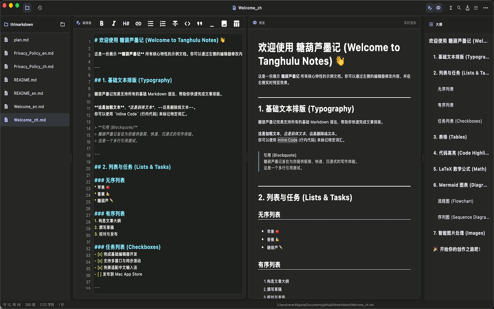
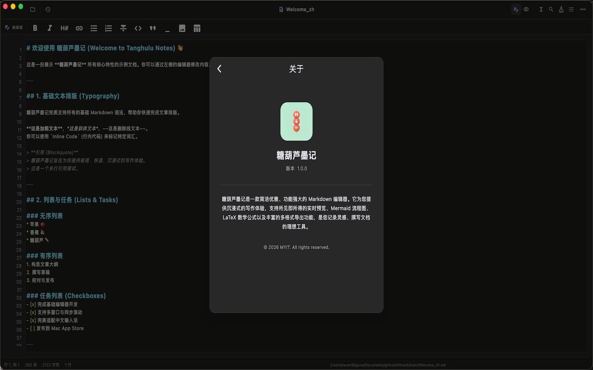

# 糖葫芦墨记

> 左写右看，实时呈现 Markdown；支持公式、图表、本地文件与多种导出格式。

**应用名称：** 糖葫芦墨记  
**副标题：** 沉浸式双栏 Markdown 与 LaTeX 笔记  
**平台：** macOS  
**关键词：** Markdown, 笔记, LaTeX, 公式, 写作, 编辑器, 双栏, 代码高亮, 思维导图, 科研

---

## 关于本应用

糖葫芦墨记是一款为 macOS 打造的 Markdown 编辑器。左侧专心写作，右侧实时阅读渲染结果，让源文本与最终排版始终并排可见。

无论是技术文档、学习笔记、会议记录还是文章草稿，糖葫芦墨记都让编辑与阅读保持在同一个清晰的工作区中。

---

## 🌟 核心功能

### 📝 沉浸式写作体验，所见即所得
- **实时双栏预览**：左侧编辑、右侧精准渲染。支持一键切换至“全屏沉浸”或“仅编辑/仅预览”模式。
- **打字机模式 & 聚焦模式**：让当前编辑行始终居中，并淡化非当前段落，助你排除干扰，心流不断。
- **同步滚动**：编辑区与预览区完美同步，长文档修改不迷路。
- **完美的中英混输**：底层输入引擎深度适配 Mac 原生拼音输入法，彻底告别字母吞字、拼音打断的恼人痛点。

### 📊 专业级排版与渲染支持
- **全语法兼容**：原生支持列表、表格、任务框（Checkboxes）、删除线等所有标准 Markdown 语法。
- **学术与工程扩展**：
  - 内置 **KaTeX 数学公式** 渲染引擎，复杂公式即刻呈现。
  - 支持 **Mermaid 流程图、时序图、甘特图**，使用代码轻松绘制专业图表。
  - 支持主流编程语言的**代码块语法高亮**。

### 📈 Mermaid 流程图与图表
- 在文档中直接使用代码绘制流程图、时序图、类图与状态图。
- 纯文本维护图表，所见即所得，清晰高效。

### 📚 强大的文档与窗口管理
- **原生多窗口**：支持同时开启多个独立文档窗口，跨屏幕、跨项目对照编辑互不干扰。
- **文件树与文档大纲**：
  - 左侧边栏支持展开当前目录的**文件树**，快速切换笔记。
  - 右侧支持提取标题生成**自动大纲**，点击即可快速跳转文档对应位置。
- **状态栏实时追踪**：底部状态栏实时显示当前行列、词数、字符数和行数统计。

### 🖼️ 丝滑的智能图片管理
- **拖拽与快捷粘贴**：直接拖入图片，或使用快捷键粘贴剪贴板截图。
- **相对路径自动保存**：自动在文档同级创建 `assets` 目录并复制图片，告别文件分享时图片丢失的尴尬。
- **支持 PicGo 图床**：一键集成 PicGo 服务，图片自动上传并返回 Markdown 外链。
- **一键瘦身清理**：内置资产清理工具，一键扫描并删除本地目录中未被文档引用的多余图片，释放磁盘空间。

### 🎨 极致的个性化定制
- **灵活的主题系统**：完美适配 macOS 浅色/深色模式（可跟随系统设置）。
- **高定排版与代码主题**：内置多种精美的排版主题和代码高亮主题，总有一款契合你的审美。
- **细节掌控**：自由设置编辑器字体、字号、Tab 缩进大小、自动换行、以及是否显示行号、高亮当前编辑行。

### 🔄 生产力无缝衔接
- **多格式导出**：一键将文档导出为纯文本、精美的 **HTML 网页** 或 **PDF 文件**。
- **查找与替换**：支持快捷键 Cmd+F，关键词即时高亮定位与一键替换。
- **自动保存与外部刷新**：支持灵活设置自动保存间隔，并能自动检测外部文件变更，确保数据永不丢失。
- **在访达中显示**：随时一键定位当前正在编辑的文件。

---

## 🆕 1.0.0 首发亮点

糖葫芦墨记 1.0.0 首发版本正式发布！

- 🚀 **经典双栏实时分屏**：左侧极致流畅输入，右侧毫秒级排版预览与光标跟随
- 📐 **深度数学公式集成**：内置 KaTeX 引擎，支持行内与独立 LaTeX 公式块渲染
- 📊 **丰富扩展语法支持**：任务清单 Checkbox、Markdown 表格、高亮、删除线、上下标与脚注
- 🔍 **全局搜索与高级替换**：支持快捷键 Cmd+F，关键词即时高亮定位与一键替换
- 🎨 **优雅主题与代码高亮**：内置多套排版渲染主题与主流代码高亮配色
- 📤 **全功能导出管线**：支持无损导出为标准 PDF、HTML 及长图
- 🖼️ **现代资产管理**：支持本地图片管理与图床自动降级

随时随地，随心记录您的每一个灵感！

---

## 🔒 隐私先行，数据属于你

糖葫芦墨记是一款纯本地驱动的应用程序。

- **0 账户要求**：无需注册，开箱即用。
- **0 数据收集**：您的所有文档、笔记、图片均保存在您的本地硬盘上。除了部分图表渲染引擎（如 Mermaid）的极轻量级本地加载外，应用没有任何后台追踪器或广告 SDK，您的隐私安全得到 100% 的保障。

---

## 联系方式

- **官网**：[https://www.thltv.com/](https://www.thltv.com/)
- **邮箱**：support@thltv.com
- **Telegram 频道**：[https://t.me/tanghulutvos](https://t.me/tanghulutvos)
- **GitHub**：[https://github.com/never88gone/THLMarkDown](https://github.com/never88gone/THLMarkDown)
